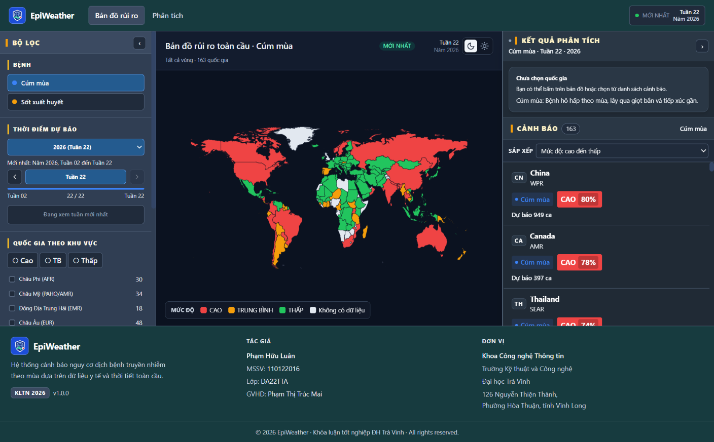

# EpiWeather - Hệ thống cảnh báo nguy cơ dịch bệnh theo mùa

Đồ án tốt nghiệp - Đại học Trà Vinh, 2026.

EpiWeather dự báo số ca và mức độ nguy cơ của cúm mùa và sốt xuất huyết theo tuần
cho từng quốc gia, dựa trên dữ liệu giám sát dịch tễ (WHO FluNet, OpenDengue) kết hợp
với dữ liệu tái phân tích thời tiết ERA5 của ECMWF. Kết quả hiển thị trên bản đồ thế giới
dạng choropleth ba mức Low/Medium/High, kèm dự báo 4 tuần tới và biểu đồ xu hướng 52 tuần
cho mỗi quốc gia.

Ý tưởng nền tảng: nhiều bệnh truyền nhiễm có tính mùa rõ rệt và biến động của chúng đi sau
điều kiện thời tiết một khoảng trễ (lag) đo được. Cúm tăng khi nhiệt độ và độ ẩm xuống thấp
vào mùa lạnh; sốt xuất huyết bùng theo chu kỳ sinh sản của muỗi sau các đợt mưa và ẩm.
Đồ án lượng hóa quan hệ trễ này bằng cross-correlation rồi đưa vào mô hình học máy để dự báo.



## Mục tiêu

Xây dựng một hệ thống hoàn chỉnh từ thu thập dữ liệu đến giao diện người dùng, chứng minh
được rằng tín hiệu thời tiết có giá trị dự báo cho dịch bệnh theo mùa và trình bày kết quả
ở dạng dùng được cho cán bộ giám sát y tế. Cụ thể, đồ án đặt ra bốn mục tiêu.

- Ghép dữ liệu dịch tễ và thời tiết về cùng lưới không gian (quốc gia, mã ISO3) và thời gian
  (tuần ISO), xử lý missing và độ trễ báo cáo.
- Đo độ trễ tối ưu giữa từng biến thời tiết và số ca bệnh bằng cross-correlation, dùng làm feature.
- Huấn luyện và so sánh nhiều mô hình cho hai bài toán song song: hồi quy số ca (regression)
  và phân loại mức cảnh báo (classification), chọn mô hình cho production dựa trên bảng so sánh.
- Đóng gói mô hình sau backend FastAPI và bản đồ tương tác React/Leaflet, triển khai bằng Docker Compose.

## Chức năng hệ thống

Giao diện gồm ba trang. Trang Home hiển thị bản đồ rủi ro toàn cầu cho 163 quốc gia, tô màu
theo mức nguy cơ và cho phép lọc theo bệnh, theo tuần và theo khu vực WHO. Trang Chi tiết quốc gia
(`/country/:iso3`) đưa ra dự báo 4 tuần tới và đường xu hướng 52 tuần khi người dùng click một nước.
Trang Analytics báo cáo hiệu năng mô hình để phục vụ đánh giá, không dùng cho vận hành hàng ngày.

| Nhóm chức năng        | Mô tả                                                                                     |
| ------------------------ | ------------------------------------------------------------------------------------------- |
| Thu thập dữ liệu      | Đồng bộ WHO FluNet và OpenDengue; xử lý ERA5 weekly 2010–2019 (17 biến thời tiết) |
| Phân tích tương quan | Cross-correlation đo lag tối ưu giữa thời tiết và số ca theo từng bệnh            |
| Dự báo số ca          | Hồi quy log1p(case_count) theo tuần, đa horizon (1–4 tuần), CV walk-forward            |
| Cảnh báo mức độ     | Endemic channel (Bortman 1999 / WHO EWARS) chia Low / Medium / High                         |
| Bản đồ cảnh báo     | Choropleth Leaflet 163 quốc gia, danh sách cảnh báo sắp xếp theo mức độ            |
| Tra cứu chi tiết       | Forecast 4 tuần + trend 52 tuần cho từng quốc gia                                       |

Về mô hình, đồ án chốt hai lựa chọn cho production sau khi so sánh: LightGBM cho hồi quy cúm
(R² = 0.902 trên CV walk-forward, kiểm chứng trên năm 2022) và Random Forest cho sốt xuất huyết
(R² = 0.937). Bài toán cảnh báo mức độ dùng XGBoost classifier với macro-F1 khoảng 0.55 (cúm)
và 0.48 (sốt xuất huyết) — số của sốt xuất huyết thấp hơn do dataset nhỏ (chỉ 35–37 quốc gia
có đủ dữ liệu ghép cặp), một hạn chế được ghi nhận trong báo cáo. Dữ liệu huấn luyện dùng
2010–2019, loại 2020–2021 vì biện pháp phòng dịch COVID làm số ca cúm giảm giả tạo, và giữ 2022
để kiểm chứng khả năng khái quát hậu COVID.

## Cấu trúc

```
src/
├── backend/                    ← FastAPI backend (Python 3.11)
│   ├── app/
│   │   ├── api/v1/endpoints/   ← REST API: countries, diseases, predictions, risk, analytics
│   │   ├── core/               ← Config, logging, exceptions
│   │   ├── crud/               ← Database CRUD operations
│   │   ├── db/                 ← SQLAlchemy session
│   │   ├── models/             ← ORM models (16 bảng)
│   │   ├── schemas/            ← Pydantic schemas
│   │   └── services/           ← ML engine, prediction service, risk service
│   ├── alembic/                ← Database migrations
│   ├── tests/                  ← pytest test suite
│   ├── Dockerfile
│   └── requirements.txt
├── frontend/                   ← React + Tailwind CSS + Leaflet + Recharts
│   ├── src/
│   │   ├── components/         ← Map, Charts, Sidebar, Alerts
│   │   ├── pages/              ← HomePage, DiseaseDetailPage, AnalyticsPage
│   │   ├── hooks/              ← useMapData, usePrediction, useRisk
│   │   └── types/              ← TypeScript type definitions
│   └── Dockerfile
├── notebooks/                  ← Notebook pipeline ML (Google Colab)
├── scripts/                    ← Seed dữ liệu, sync data, batch predict, bootstrap DB
├── ml_models/                  ← Model đã huấn luyện (.pkl + _features.json + _metrics.json)
├── data/                       ← Dữ liệu thô và đã xử lý (CSV)
│   ├── epidemic/raw/           ← WHO FluNet, OpenDengue
│   ├── weather/processed/      ← ERA5 weekly 2010-2019
│   └── processed/              ← Feature CSV cho FastAPI
├── outputs/                    ← Hình sinh ra từ pipeline
├── kltn_schema.sql             ← Schema PostgreSQL đầy đủ (16 bảng + 1 view)
├── docker-compose.yml          ← Triển khai toàn bộ stack (db + backend + frontend + scheduler)
├── Dockerfile.scheduler        ← Image cho seed + scheduler service
├── Makefile / dev.ps1          ← Lệnh tiện ích (Linux/macOS và Windows)
└── .env.example                ← Template biến môi trường
```

## Chạy bằng Docker Compose

```bash
cd src
cp .env.example .env          # chỉnh DB_PASSWORD trước khi chạy
docker compose up -d
docker compose exec backend python scripts/seed_countries.py
curl http://localhost:8000/health
```

Frontend: http://localhost:3000 — API docs: http://localhost:8000/docs

## Khôi phục database từ schema

```bash
psql -U postgres -c "CREATE DATABASE kltn_epiweather;"
psql -U postgres -d kltn_epiweather -f kltn_schema.sql
```


Tác giả

|                           |                                                                   |
| ------------------------- | ----------------------------------------------------------------- |
| Sinh viên                | Phạm Hữu Luân                                                  |
| MSSV                      | 110122016                                                         |
| Lớp                      | DA22TTA                                                           |
| Giảng viên hướng dẫn | Phạm Thị Trúc Mai                                              |
| Khoa                      | Công nghệ Thông tin - Trường Kỹ thuật và Công nghệ     |
| Trường                  | Đại học Trà Vinh                                              |
| Địa chỉ                | 126 Nguyễn Thiện Thành, Phường Hòa Thuận, tỉnh Vĩnh Long |

Đồ án tốt nghiệp 2026 — EpiWeather v1.0.0.
